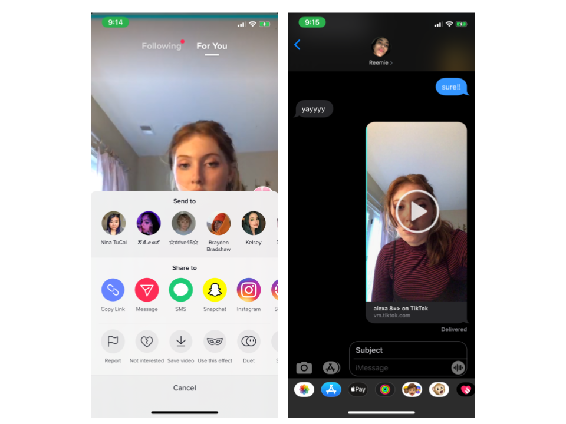
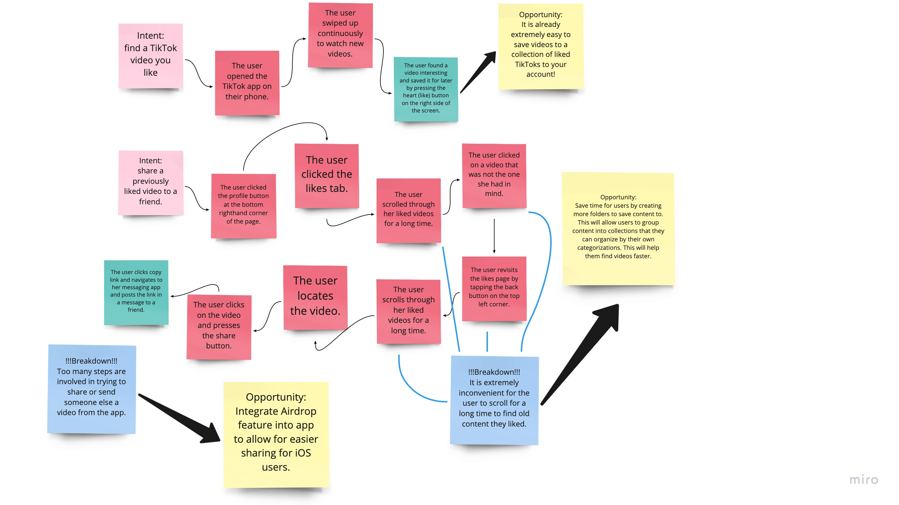
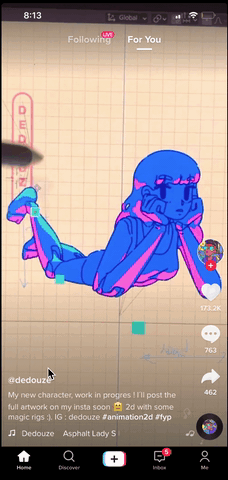
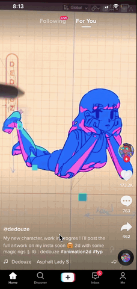

# Redesigning TikTok

<p> We're glued to our phones for good reason! Tiktok (an app for making and sharing short 15 to 30 second videos) encourages creativity from amateur dancing videos to insanely talented cosplay transformations and keeps us all connected by allowing users to share tiktoks to other social media platforms and people. </p>

### Problem Space

Despite the newness of the app, compared to Twitter or Instagram, TikTok has become a vibrant place for short-form videos that are literally about any topic. Want anime commentary or recommendations? 60-second recipe tutorials? How about current events and live footage of the BLM protests (that are still going on, btw)? People are making videos on it! Anything that you want to see on your FYP (For You Page), the algorithm has got you covered. That's why it's probably so addicting to keep scrolling... 

Another thing that is almost as equally as addicting is actually sharing tiktoks with other users in the app **and** other people. Plus, the app makes it quite easy to share content, save content (by liking the tiktok on your screen), and even follow creators who make the kind of content you like to watch. However, there's a pretty big catch. Every like button you press adds another tiktok to your saved likes. Doesn't sound so bad? Now imagine trying to show your friend a funny tiktok video you saw a couple days ago only to realize (much to your horror) that you were quite busy on the app recently, and now the video you were going to show your friend is buried deep in your unorganized chaos of liked videos. What to do, what to do?

Well, for now I guess you could keep scrolling until you see something familiar. However, that is a huge waste of time! Especially if you're looking for something that's even further down the list! The goal of this assignment is to redesign an aspect of the popular social media platform, TikTok, by adding a feature that would allow users to organize their saved tiktok videos better into groupings called Collections. That way, it would be easier to navigate through the app and stay organized while liking a bunch of content from other creators.

### Contextual Inquiry

I conducted a contextual inquiry to better understand what is currently lacking in the organizational experience pertaining to Tiktok, and how much responsiblity is put on the user to remember when/where TikToks are saved and any contextual clues to help them find the saved video better. I specifically focused on navigating the saved likes page, located on the user's profile page. 

The user for our contextual inquiry is a fellow student at Hopkins, who is an avid phone and social media user. This person has used TikTok before, and is already comfortable for navigating the app. The subject was given a series of three tasks that resemble what a seamless experience would look like for a consumer using TikTok.

```markdown
First Task: Scroll around your FYP and find a video you are interested in.
```
The first task was pretty simple, I asked her to scroll around her feeds and consume content for a couple of moments. Given the fact that most videos are around 15 seconds long, I waited 30 seconds and asked her how many videos she had already liked (meaning she pressed the like button, not just enjoyed haha). 

"Uhh, so far 2," she told me. This further supports my suspicion that a lot of users are rapidfire consuming content, and not necessarily remembering any clear markers that would help them pull up the video to watch at a later time (like for example, when they watched it or who made the tiktok video).  

```markdown
Second Task: Save the TikTok and share it with a friend. 
```
Next, I asked her to save a Tiktok to her liked videos and also share the video with a friend. She continued scrolling and scrolling on her FYP until she came across something she liked. On the bottom righthand corner of the screen, she pressed the share button. Then, she pressed the SMS button and shared it with me. 


         
```markdown
Third Task: Find a meme you found really funny a long time ago and try to find it. Share it with a friend.
```
Finally, for the last task I told her to think of a funny meme she liked from a week or two ago and try to find it. First, she navigated to her profile page in the bottom right corner of the app. Next, she clicked on her likes tab. Then she scrolled for a really long time through her likes, pausing to click on various tiktoks only to realize a few seconds in that it was the wrong one. She repeated this process until she finally found the right one. 


         
### Interpretation

Some thoughts that we both shared about this user experience was that it can be quite frustrating to scroll for a long time to look for something that only plays for 15 seconds or so. It can even lead to someone giving up entirely on finding that one funny or cool video and not sharing or showing it to their friends. This is a major drawback of the app that I had to address in redesigning this app. Overall, TikTok is a pretty seamless app, with not many screens, and it is worth mentioning the versatility of hosting not only a platform for people to watch media catered to their likes but also a platform where people can record, upload, edit, trim, apply filters and transitions, and most importantly share their videos with other people on the app. I am not looking to improve that aspect of the platform, but rather the lack of organization when it comes to saving liked content. There is a lot of responsiblilty placed on the user to recall important key details that would distinguish/identify the video they were looking for, which decreases the enjoyment of using the app significantly. 


### Sequential Model

In order to organize the actions involved in the task, as well as the observations I made when watching the subject perform the tasks, I created a sequential model on Miro to better summarize the key takeaways from the contextual inquiry. The breakdowns helped me figure out what the app was lacking the most. 



### Prototype
I created a protype (on Figma) of the ideas I gathered from the sequential model.

Listed below are the features I implemented in the prototype:

```markdown
1. Airdrop feature allows for easier sharing for iOS users
```
To use this feature, navigate to the share button on the right of the screen. Airdrop is listed as one of the share features.



```markdown
2. Highlighted posts on a creator's page
shows you which ones you have already liked
```
To use this feature, navigate to the creator's user profile. There, you can scroll and see highlighted posts that you have already liked. They will have a heart icon on them.


```markdown
3. Collections workflow in the app allows you to 
create collections for better organization and recall of saved videos
```
To create a new collection, navigate to the share button on the right of the screen. Then, click the ***create new collection*** button that is listed at the end of the row. The top bar shows you all of your collections, ordered from most to least recent. You can also scroll right to look through all your collections. Then, you can add a title to the collection and click create. 

To view your collections, navigate to your user profile. There, you will find the collections tab. You can see all of your collections and clicking on a collection will navigate you to the full listing of all the TikTok content saved to that collection. Clicking the title of the collection will take you back to the collections tab. 



### [Evaluation Video](https://youtu.be/sU88GggSBM8)

```markdown
https://youtu.be/sU88GggSBM8
```
